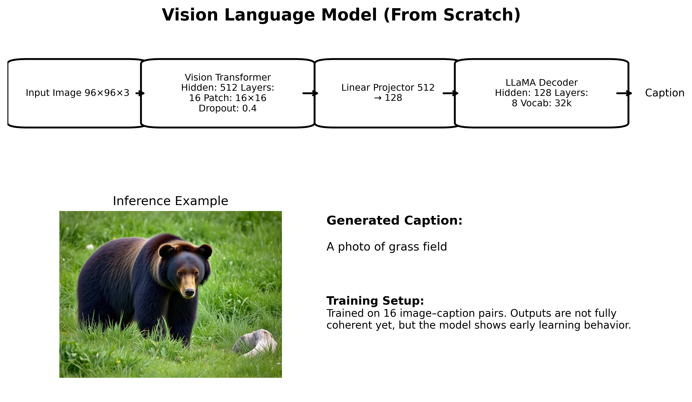

# Vision Language Model (From Scratch)

This repository presents a Vision Language Model (VLM) implemented entirely from scratch using a Vision Transformer (ViT) as the image encoder and a LLaMA-style causal language model as the text decoder.

The objective of this project is to explore multimodal learning by integrating visual representations with autoregressive language modeling in a unified architecture.

---

## Architecture

The model consists of three primary components:

1. Vision Encoder (ViT)
2. Linear Projection Layer
3. LLaMA-style Decoder

The overall architecture is shown below:

---

## Model Configuration

### Vision Encoder (ViT)
- Input Resolution: 96 × 96 × 3
- Patch Size: 16 × 16
- Hidden Dimension: 512
- Number of Transformer Layers: 16
- Intermediate Dimension: 2048
- Activation Function: GELU
- Dropout: 0.4

The Vision Transformer encodes the input image into a 512-dimensional representation.

### Image Projection
- Linear Mapping: 512 → 128

This layer aligns visual features with the language model embedding space.

### Language Decoder (LLaMA-style)
- Vocabulary Size: 32,000
- Embedding Dimension: 128
- Number of Decoder Layers: 8
- Self-Attention Dimension: 128
- Intermediate Dimension: 11008
- Activation Function: SiLU
- Normalization: RMSNorm

The decoder generates captions autoregressively conditioned on the projected visual embeddings.

---

## Dataset

The model was trained on a small experimental dataset consisting of 16 image–caption pairs.

The primary goal of this work is architectural understanding and implementation, rather than large-scale performance optimization.

---

## Research Motivation

This project aims to:

- Implement a multimodal transformer architecture from first principles
- Understand the interaction between visual encoders and autoregressive decoders
- Explore image-to-text generation using a unified transformer framework
- Study the behavior of small-scale multimodal training setups

---

## Future Directions

- Scaling to larger datasets
- Incorporating pretrained vision and language backbones
- Improving multimodal alignment mechanisms
- Evaluating with standard captioning benchmarks
